# ChatGPTで儲かるデータ分析   サポートサイト

　当サイトは書籍「ChatGPTで儲かるデータ分析」のサポートサイトです。

　当書籍はOpen AIの有償ライセンスであるChatGPT plusの利用を前提としています。
　

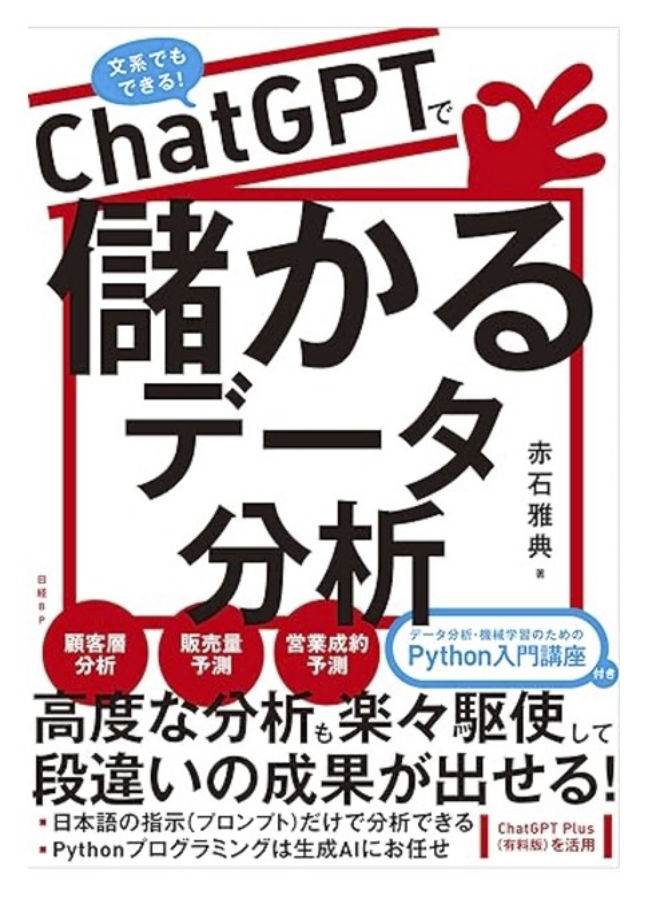

　

#### Amazonリンク
[単行本](https://www.amazon.co.jp/dp/4296071009)   
[Kindle(準備中)]()  

## 著者メッセージ

　次の一文はまえがきからの引用で、今、著者が最も強く感じていることです。

「**今こそデータ分析を学ぶべきです。生成AIの助けがあれば、今までよりはるかに早く、成果を出せる分析が可能なので。**」

　生成AI前と生成AI後のデータ分析学習方法の違いをまとめると次のようになります。

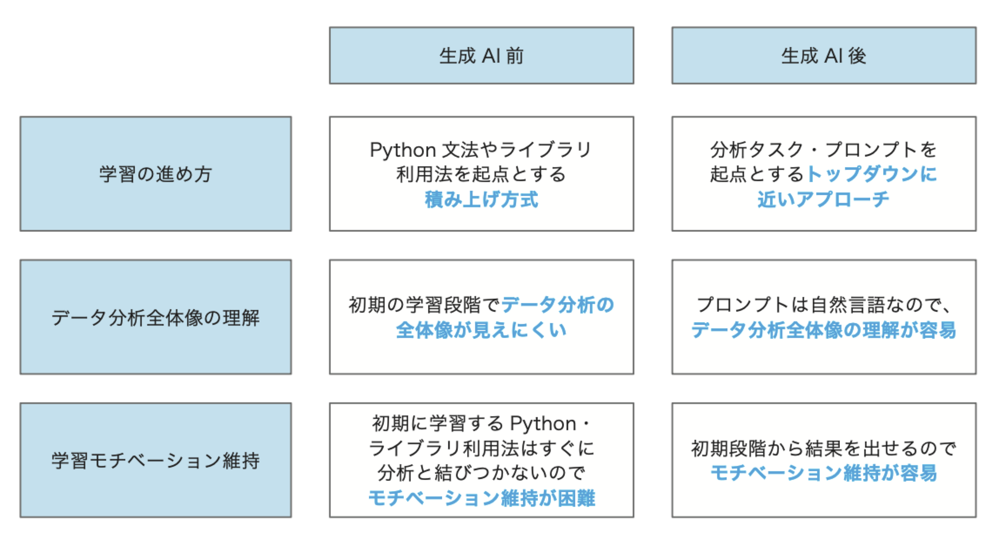

　本書は**生成AIを活用してデータ分析を学びたい読者の道しるべ**となることを意図して執筆しました。

　

## 本書の対象読者

主に次のような読者を想定しています。

* 普段の業務に課題を感じているが、データ分析を使ってそれをどう解決したらいいのかわからない
* データ分析でやりたいことはあるが、データ分析・Python学習のハードルが高すぎで自力で解決できない　
* これを機会にPythonのデータ分析プログラミングを学びたい
* 会社の中でAI・データ分析プロジェクトを推進していきたい

## 本書の特徴

本書は次のような特徴を持っています。
　

* 分析手法と業務シナリオの関係を整理
* 実習の冒頭で分析タスク全体像を提示
* すぐに動かせる実習資材付き
* ビジネスとのつながりを重視
* データ分析・AIプロジェクト推進のツボを集約 (9章)
* 必要最小限のPython知識をコンパクトに集約 (講座)

　それぞれについて、概要を紹介します。

### 分析手法と業務シナリオの関係を整理

　2章では、データ分析の各手法と、業務シナリオ適用例の関係を整理しています。

　この章を一通り読むことで、どのような業務にどのような分析手法を適用できるのかのおおまななイメージを持つことができます。

 

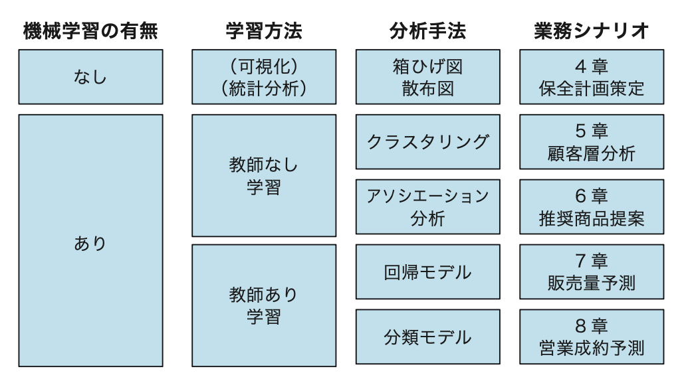

### 実習の冒頭で分析タスク全体像を提示

　応用編各章の冒頭では、次のような表で分析タスクの全体像をまとめています。

　この表を参照することで、個別タスクの中で、自分のやっていることがわからず迷子になることがなくなります。

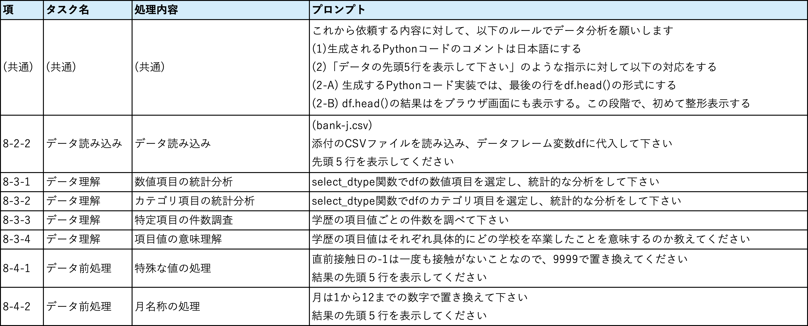

### すぐに動かせる実習資材付き

　応用編各章では、分析で必要なデータ、ライブラリ、そしてすぐにコピペして使える「プロンプト集」と、実習で必要な資材をすべてサポートサイトからダウンロードできます。

プロンプト集のとおりの指示を生成AIに出すだけで、驚くような分析結果がすぐに得られます。

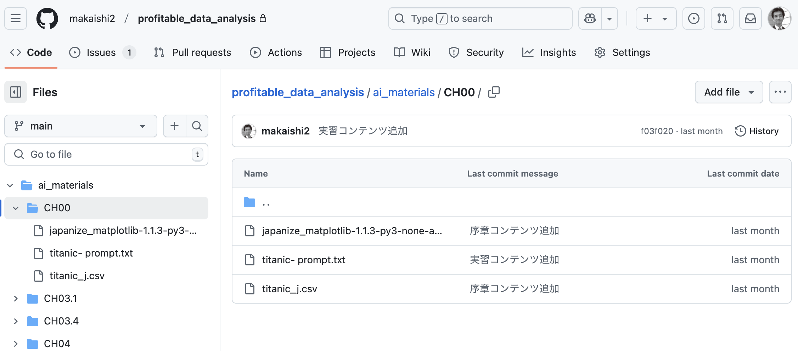

**実習結果のサンプル**

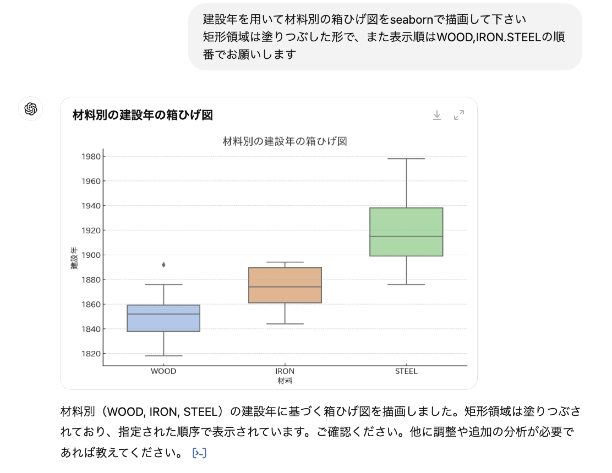

### ビジネスとのつながりを重視

　データ分析では分析結果をビジネスに反映させるプロセスが最も重要です。

　実習のストーリーの最後に、このプロセスのヒントになるようなタスクも含めています。

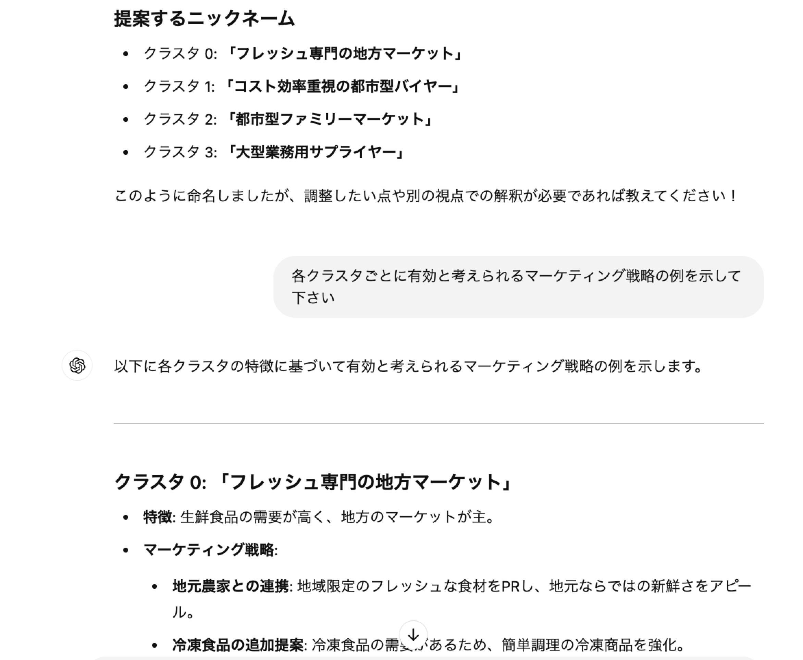

###  データ分析・AIプロジェクト推進のツボを集約(9章)

　9章は、**データ分析・AIプロジェクトを推進する立場の方向け**に、データ分析・AIプロジェクト固有の「ツボ」をまとめました。

以下では9章で参照している図の一部をご紹介します。
　
 **データ分析・AIの適用対象**

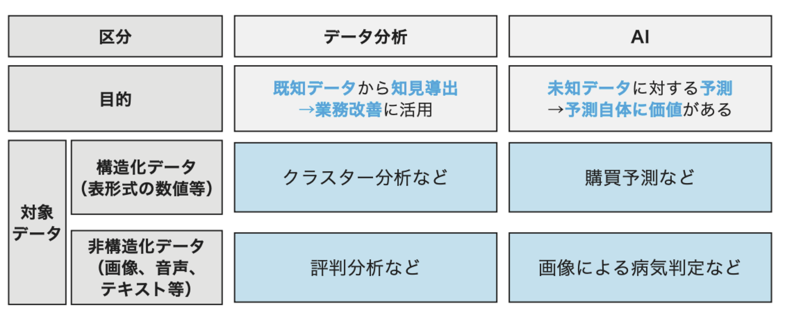

　

 **データ分析・AIの人材定義**

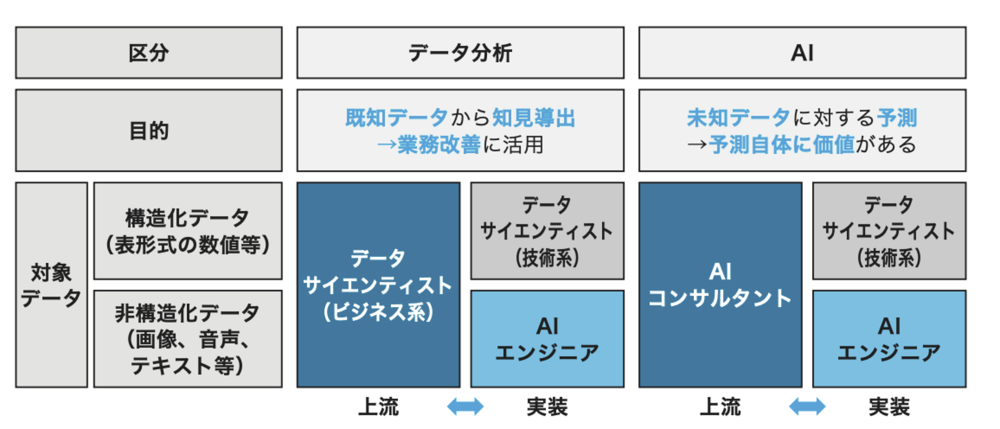

　

**生成AIの活用方法**

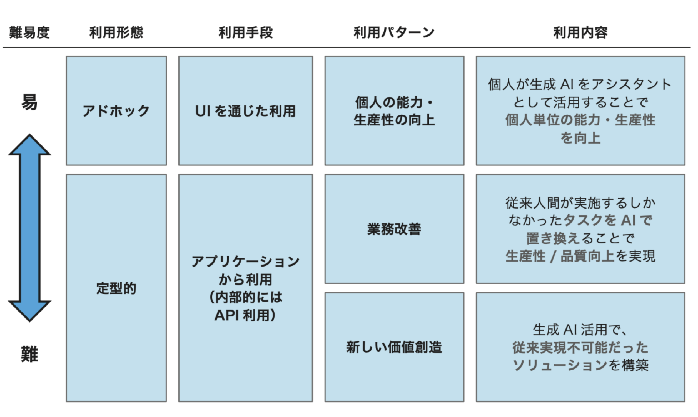

 **AI適用範囲の検討方法**

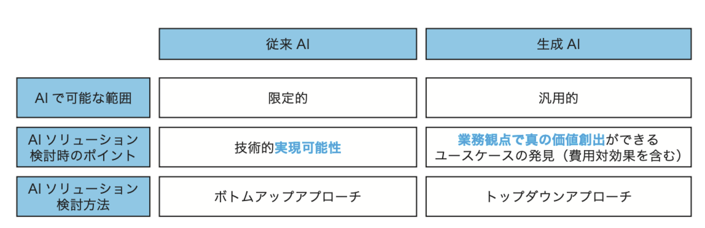

### 必要最小限のPython知識をコンパクトに集約 (講座)

　生成AIにほとんど任せられるようになったとはいえ、Pythonのプログラミング知識をまったくなしにデータ分析を行うのは危険で、必要最小限の知識は必要です。

　本書は、**巻末の「講座」に約100ページかけてPythonプログラムの初歩からデータ処理の基本までをコンパクトに整理**しました。あわせて統計処理の初歩についてもまとめています。

　最初から体系立って学習するのにも、必要な箇所だけ辞書的に使うのにも対応できる形になっていますので、Python学習の地図として活用して下さい。

**データフレームの構造**(講座1.4より)

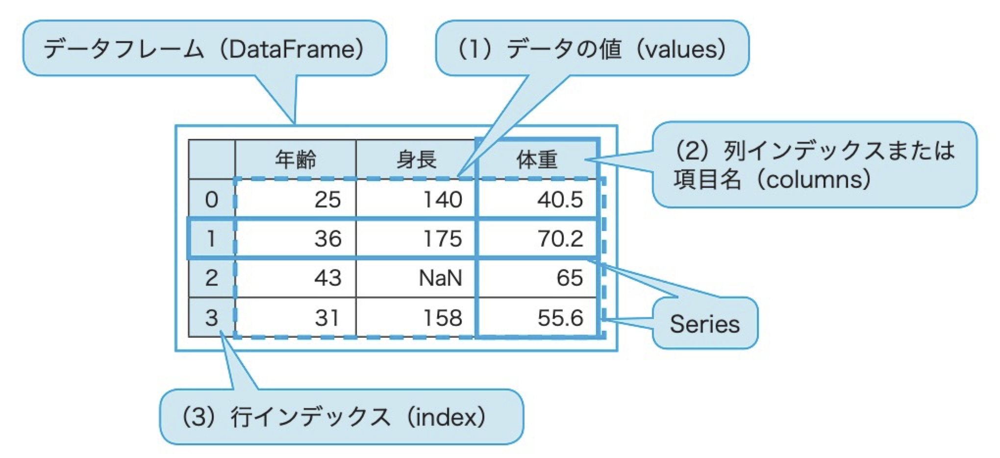

**データの「尺度」**(講座2.1より)

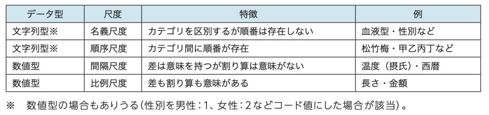

