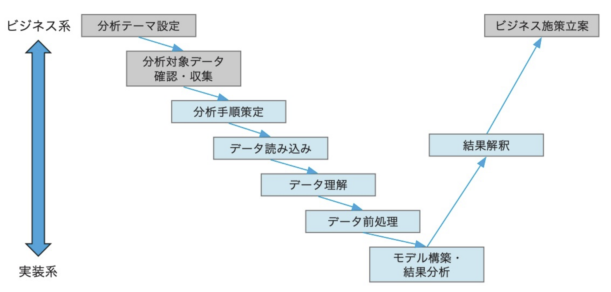
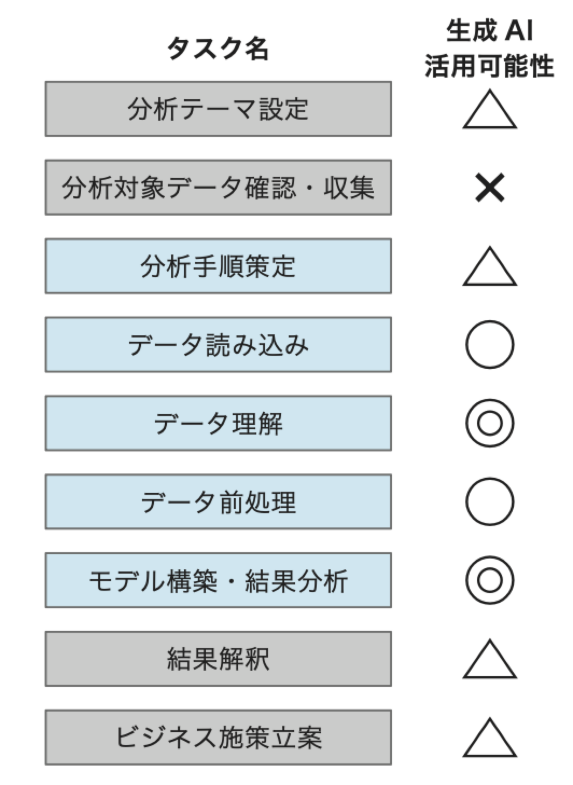

# ChatGPTで儲かるデータ分析   サポートサイト

　当サイトは書籍「ChatGPTで儲かるデータ分析」のサポートサイトです。

　当書籍はOpen AIの有償ライセンスであるChatGPT Plusの利用を前提としています。
　

　

#### Amazonリンク
[単行本](https://www.amazon.co.jp/dp/4296071009)   
[Kindle](https://www.amazon.co.jp/dp/B0F1CDXJNW)   

## 著者メッセージ

　次の一文はまえがきからの引用で、今、著者が最も強く感じていることです。

「**今こそデータ分析を学ぶべきです。生成AIの助けがあれば、今までよりはるかに早く、成果を出せる分析が可能なので。**」

　生成AI前と生成AI後のデータ分析学習方法の違いをまとめると次のようになります。

　本書は**生成AIを活用してデータ分析を学びたい読者の道しるべ**となることを意図して執筆しました。

　

## 本書の対象読者

主に次のような読者を想定しています。

* 普段の業務に課題を感じているが、データ分析を使ってそれをどう解決したらいいのかわからない

* データ分析でやりたいことはあるが、データ分析・Python学習のハードルが高すぎで自力で解決できない　

* これを機会にPythonのデータ分析プログラミングを学びたい

* 会社の中でAI・データ分析プロジェクトを推進していきたい

  

## 本書の特徴

本書は次のような特徴を持っています。
　

* 分析手法の各プロセスと生成AIの関係を整理 (1章)
* 分析手法と業務シナリオの関係を整理 (2章)
* 実習の冒頭で分析タスク全体像を提示 (3章〜8章)
* すぐに動かせる実習資材付き (3章〜8章)
* ビジネスとのつながりを重視 (3章〜8章)
* データ分析・AIプロジェクト推進のツボを集約 (9章)
* 必要最小限のPython知識をコンパクトに集約 (講座)

　それぞれについて、概要を紹介します。

### 分析手法の各プロセスと生成AIの関係を整理 (1章)

　1章では、データ分析プロセスの全体像を示した後、各プロセスに対して生成AIがどの程度活用可能かを整理しています。

### 分析手法と業務シナリオの関係を整理 (2章)

　2章では、データ分析の各手法と、業務シナリオ適用例の関係を整理しています。

　この章を一通り読むことで、どのような業務にどのような分析手法を適用できるのかのおおまかなイメージを持つことができます。

### 実習の冒頭で分析タスク全体像を提示 (3章〜8章)

　応用編各章の冒頭では、次のような表で分析タスクの全体像をまとめています。

　この表を参照することで、個別タスクの中で、自分のやっていることがわからず迷子になることがなくなります。

### すぐに動かせる実習資材付き (3章〜8章)

　応用編各章では、分析で必要なデータ、ライブラリ、そしてすぐにコピペして使える「プロンプト集」と、実習で必要な資材をすべてサポートサイトからダウンロードできます。

プロンプト集のとおりの指示を生成AIに出すだけで、驚くような分析結果がすぐに得られます。

**実習結果のサンプル**

### ビジネスとのつながりを重視 (3章〜8章)

　データ分析では分析結果をビジネスに反映させるプロセスが最も重要です。

　実習のストーリーの最後に、このプロセスのヒントになるようなタスクも含めています。

###  データ分析・AIプロジェクト推進のツボを集約(9章)

　9章は、**データ分析・AIプロジェクトを推進する立場の方向け**に、データ分析・AIプロジェクト固有の「ツボ」をまとめました。

以下では9章で参照している図の一部をご紹介します。
　

 **データ分析・AIの適用対象**

　

 **データ分析・AIの人材定義**

　

**生成AIの活用方法**

 **AI適用範囲の検討方法**

### 必要最小限のPython知識をコンパクトに集約 (講座)

　生成AIにほとんど任せられるようになったとはいえ、Pythonのプログラミング知識をまったくなしにデータ分析を行うのは危険で、必要最小限の知識は必要です。

　本書は、**巻末の「講座」に約100ページかけてPythonプログラムの初歩からデータ処理の基本までをコンパクトに整理**しました。あわせて統計処理の初歩についてもまとめています。

　最初から体系立って学習するのにも、必要な箇所だけ辞書的に使うのにも対応できる形になっていますので、Python学習の地図として活用して下さい。

**データフレームの構造**(講座1.4より)

**データの「尺度」**(講座2.1より)

##  リンク集
#### 著者発信の情報

| ソース | タイトル                               | リンク                                                 | 補足                                                 |
| ------ | -------------------------------------- | ------------------------------------------------------ | ---------------------------------------------------- |
| Youtube | データサイエンティスト協会主催講演会ビデオ | https://bit.ly/4iM52eX | 2025年4月24日(水)データサイエンティスト協会主催の講演会のビデオ動画です |
| speakerdeck | データサイエンティスト協会主催講演会資料 | https://bit.ly/44mGHJc | 2025年4月24日(水)データサイエンティスト協会主催の講演会の資料です |
| Github | データサイエンティスト協会主催講演会　デモ資材 | https://bit.ly/42K30G3 | 2025年4月24日(水)データサイエンティスト協会主催の講演で利用したでデモ資材です |
| 日経BOOK PLUS | はじめに：『ChatGPTで儲かるデータ分析』                      | https://bit.ly/4jO9CtQ | 本書のまえがきを全文掲載しています             |
| qiita  | タイタニック・データセットで決定木分析 | https://bit.ly/42Tm7xL | 序章の実習で結果のみ示されている決定木の解説記事です |

#### 外部リンク

| ソース        | タイトル                                                     | リンク                 | 補足                                                         |
| ------------- | ------------------------------------------------------------ | ---------------------- | ------------------------------------------------------------ |
| 日経BOOK PLUS | からあげが推す「生成AI時代のデータ分析の新たな学習法を示す」一冊 | https://bit.ly/4jPK9Ai | 有名なブロガーである「からあげ」さんの書評です               |
| note          | 「ChatGPT で儲かるデータ分析」の続編を ChatGPT と Python で  | https://bit.ly/44hnMzv | 「ネイピアDS」さんが、本書の8章の実習を深掘りした結果を記事にしていただきました |

#### FAQ

データサイエンティスト協会主催の講演会でいただいたご質問を中心に本書に関連するFAQをまとめました

| ID   | 質問                                                         | 回答                                                         |
| ---- | ------------------------------------------------------------ | ------------------------------------------------------------ |
| Q01  | Pythonを使って分析をしようと思います。      その前に他社がPythonを使ってどんな分析をしたのか事例を知りたいのですが、調べる方法などありますでしょうか？      特に、課題と分析手法と効果が分かれば嬉しいです | 書籍の4章から8章では、個別のビジネスケース、適用した分析手法、効果などのシナリオが一通り含まれているので、まずはこのシナリオを通しで読んでいただき、典型的パターンを理解するところから初めて下さい。       Kaggle(英語)やsignate(日本語)などのサイトにアクセスするとより多くの活用事例のバリエーションを得られます     初級者はこれらのサイトの情報だけでは、特にビジネス観点の理解が難しい部分もありますが、そこは生成AIに教えてもらうといいかと思います |
| Q02  | 生成AIを利用することによってデータ分析におけるPythonやライブラリの記法・文法に関する習熟度への依存度が下がったと認識しています。     　 しかしプロンプトの生成やタスクに応じたプロンプトの分割、手順の生成にはどうしてもデータ分析の素養が求められるように思います。     　 上記を前提として2点質問がございます。     　 (Q002-1) 経験の浅いメンバーが生成AIを補助的に利用する時、社内やチームでどのようなレビュープロセスを用意すべきでしょうか。     　 (Q002-2) 未経験者が生成AIの誤りに気づきやすい状態を作る仕組みやプロセスはありますでしょうか? | (A02-1)講演でも話したとおり、これからの時代に一番重要なのは「問いを発する力」つまり「プロンプトを考える力」なのかと思います。       なので、レビュープロセスでは、経験の浅いメンバーに「なぜこのプロンプトを出したのか」を説明してもらい、その正しさを有識者がチェックすると効率よくスキルを付けることができるかと思います。      (A02-2)上記レビュープロセスの過程で、それぞれのAIの結果に対して都度「このAIの結果は正しいと思うか」を質問し、間違いがある場合は都度有識者がその具体的なところを指摘する対応をとってはいかがでしょうか。ちょうど、講演の最後のところで話した「AIのハルシネーション事例」の指摘を有識者が行うイメージです |
| Q03  | デモの冒頭で実施した、日本語ライブラリの導入に使ったファイルはオープンソースとして拾えるものですか?また、おすすめのものがありましたらURLなど教えていただけると嬉しいです。 | 実習で利用したjapanize_matplotlibはOSSとしてダウンロード可能なライプラリです。      通常、Google Colabなどの環境から利用する場合は「!pip install  japanize_matplotlib」という呼び出し方で使えるのですが、 ChatGPTの仮想python環境では、インターネットに直接アクセスできないため、ライブラリをいったんwhl形式のローカルファイルにして、それをChatGPTにアップロードする方式をとります。このこと自体、ChatGPT利用のTipsになります。 |
| Q04  | デモの最初でインストールが必要とのことでしたが、何をどのようにインストールすればよろしいでしょうか。 | インストールが必要なのはグラフの日本語化表示をするためのinstall  japanize_matplotlibというライブラリです。       ChatGPTを使う場合、デモでやったようにライブラリファイルを添付した上で、「グラフが文字化けしないよう、添付のライブラリを!pipコマンドで導入してください」というプロンプトを流すと、AIがPython仮想環境に対してライブラリのインストールをやってくれます |
| Q05  | 現在、「claude」という生成AIを使用しているのですが、やはりchatgptの方がいいのでしょうか。「claude」の方がレスポンスも早く正確な気がするのですが… | 現時点でclaudeそのものがPythonの仮想環境を持っていることはなさそうです。      アカウントを作って即、データ分析ができるという点において、ChatGPT plusの方が初心者に向いていると思います。 |
| Q06  | GPTに複数のテキストファイルを読み込ませる時、どこに注意する必要がありますか？　それを処理する場合の注意点を教えてください。     アンケートなどの複数のテキストです。 | いったん、個別ファイルごとにアップして、整形や表にするなどの指示を出します。その後で複数のデータを組み合わせる指示を出すと、効率よく分析が可能かと思います。 |
| Q07  | コードは理解できるレベルの学習で、覚える必要性は高くないという認識でよろしいでしょうか | 自分でゼロから作る必要はなくなりました(英作文はやらなくていい)。しかし、まだAIは間違えることがあるので、AIのコードが正しいかを確認できるスキルは必要です。これは「英文解釈ができる力」と例えることができると思います。 |
| Q08  | 文系DX社員です。      いつもPythonなど自己学習する前に環境設定で躓くことが多いです。      先のデモの冒頭であったような、【こうゆうことは先に設定しておかないといけないよ情報】を効率よく知るにはどうしたらよいのでしょうか？     TIPS的な知識を得るのになにか有用なサイトや書籍・資格試験などあれば教えて頂きたいです。     　 （DX社員なら当たり前に知ってるでしょ？的知識を身に着けたい） | 私もPythonの初級者向けの書籍を数多く出しているので、環境準備のハードルの高さはよく理解しています。       自分でChatGPTを操作して言えることとして、データ分析目的で必要なTIPSは「コメントの日本語化指示」と「グラフ日本語化ライブラリの導入」の2点だけです。      あとは、すぐにでも自分のやりたい分析ができると考えて下さい。 |
| Q09  | きちんとしたコードレビューをする際に、自然言語の指示の間違いに気づけるか、プログラムコードの記述でデバッガなどを使って検証すべきかの難易度によって、プロンプトベースのコーディングでいいかどうかが変わるように思います。どちらでの検証の方が向いているかなど、コード生成の前に判断するための基準などありますでしょうか？ | 非常に難しいタスクに関するご質問です。      AIとのやりとりを定期的に有識者にレビューしてもらい、そこでプロンプトのロジックのあやまりを指摘してもらうことが現実的な方法と思います。 |
| Q10  | プログラミング初心者です。普段から学習にChatGPTを使っています。     　 ChatGPTに例題を作ってもらう、自分が作ったコードや考察を添削してもらう、用語について説明してもらう以外に有効な利用方法があればご教授ください。 | このような会話的なやりかたでうまくいかないのは、体系的な理解が不十分になる点です。      そこで、何か標準的な教科書を1つ決めて、「教科書の勉強をAIを家庭教師に実施する」アプローチを推奨します。      手前味噌ではありますが、拙著「最短コースでわかる  Pythonプログラミングとデータ分析」はこの目的で最適な教科書と思っていますので、是非お試し下さい。 |
| Q11  | データサイエンティストとして、これから生成AIより優位な価値を提供できる人材になるために学ぶべき/大切にすべきスキルや領域はどのようなものがあると考えてますか？AI使ったモデル構築ツールのスキルor  pythonスキルでいうとどちらが優先度高いと考えられてますか？ | ご質問いただいた2つの領域はどちらも生成AIの得意領域であり、この領域でAIと張り合おうとするのは、今後、有効な方策ではないと思います。      それよりも、「問いを立てる力」をつけることに注力していただくのがいいかと思います。 |
| Q12  | 儲かるデータ分析とは、一言でいうとどんなことでしょうか。本のPRでいいのですが。 | デモでご紹介した「クラスタリング」や「営業成約予測」など、ビジネスですぐに使えるユースケースを紹介し、今までデータ分析とは縁が遠かった方にもデータ分析を活用していただくようなところを目標とした書籍です |
| Q13  | タイタニック以外に、赤石さんがオススメの学習用のコンペは何かありますか？ | 書籍の4章から8章はすべて公開データセットを題材とした分析です。このあたりを一通り理解いただくと、「データ分析でできること」のイメージを持てるようになるかと思います。 |
| Q14  | データ分析を実施する中で、各生成AIを利用することでのデータ漏えいリスク（open  AI側にデータを閲覧される等）はありますか？ | opne  AIのアカウント設定で特定のフラグをセットしておくと、分析用にアップしたデータを再利用しないルールです。     しかし、このopen AIの言い分を100%信用できるかという点はあります。      会社ごとに、データ漏洩防止のためのポリシーは定めていると思うので、必ずそのルールには従うようにして下さい。 |

